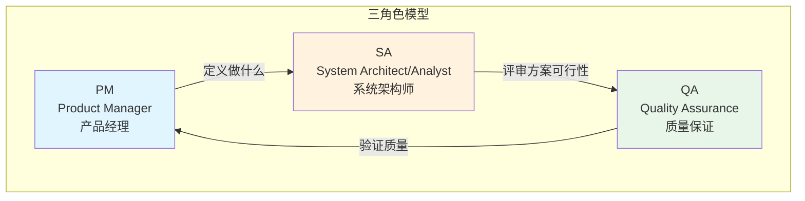
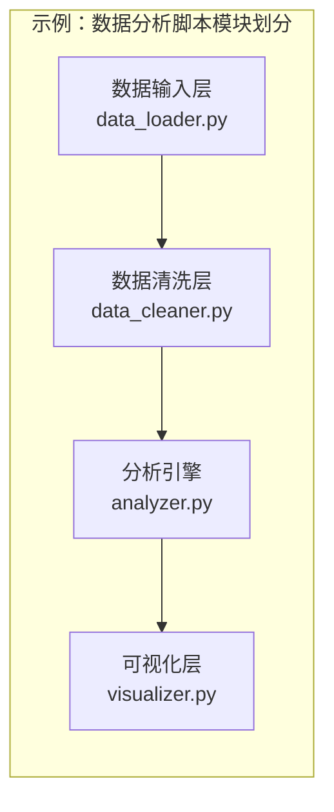
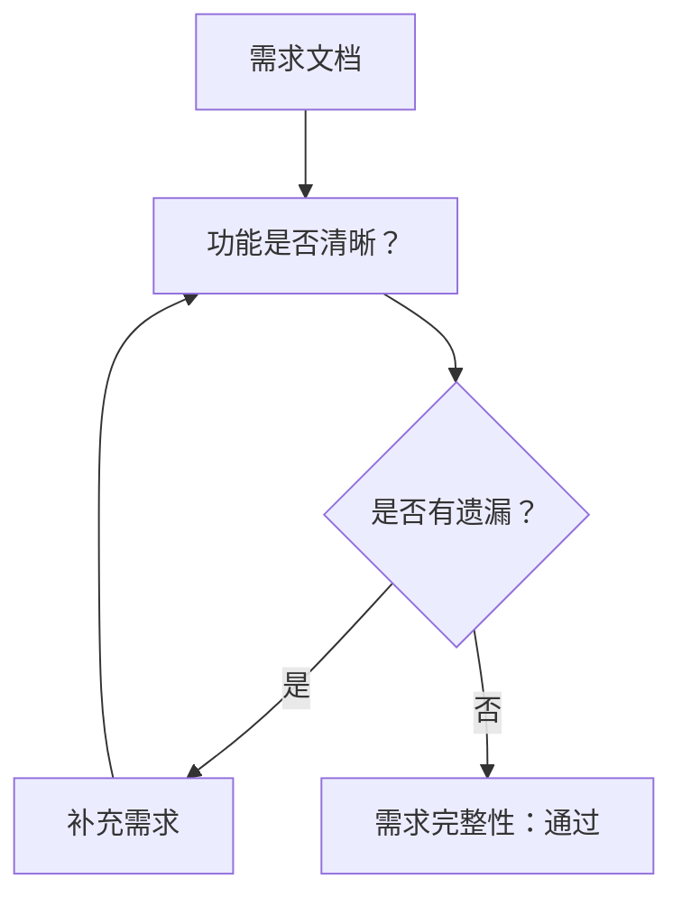

## 1. 引言

### 这套工作流的来源和背景

本文介绍的工作流并非凭空产生，而是源自对软件工程最佳实践的提炼与适配。很多博士生和个人开发者在写研究代码时，习惯于"想到哪写到哪"的方式——先有个大概想法，然后直接动手写代码，遇到问题再改。这种方式在代码规模较小时看似高效，但随着项目复杂度增加，问题会迅速累积：代码难以维护、实验结果难以复现、别人看不懂你的代码、甚至自己过段时间也看不懂。

这套工作流融合了三个核心来源：
1. **传统软件工程的瀑布模型与敏捷实践**：强调需求先行、设计在前
2. **学术研究的可复现性要求**：确保你的代码和实验结果可以被自己、审稿人和社区验证
3. **AI辅助开发的新挑战**：如何验证AI生成的代码是否符合你的预期

### 为什么博士研究者需要一套系统的工作流程

学术研究的核心价值之一是**可复现性**（Reproducibility）。当你的论文声称"方法A比方法B好10%"，审稿人和后续研究者需要能够：
- 理解你做了什么
- 在相同条件下运行你的代码
- 得到相同或近似的结果

如果你的代码缺乏规范的结构、测试和文档，这个链条就会断裂。更糟糕的是，你可能会在debug中花费大量时间，而这些都是可以避免的。

举一个具体的例子：假设你在做机器学习实验，代码里随机种子没设置、数据预处理逻辑分散在多个脚本里、模型参数硬编码在代码中。这种代码即使能跑出"好结果"，也无法让人相信这个结果是稳定可靠的——换个随机种子可能就截然不同。

系统的工作流程能帮助你：
- **明确你要解决的问题**：避免做着做着发现需求理解错了
- **记录技术决策的理由**：半年后回头看知道自己为什么选了某个框架
- **建立可复现的实验环境**：让结果稳定、可验证
- **降低协作门槛**：导师、审稿人、合作者能看懂你的工作

### 个人开发者在使用AI辅助时的独特挑战

现代AI助手（如Claude、Copilot）能帮我们快速生成代码，但这带来了独特的挑战：**AI生成的代码看起来正确，但可能完全不是你想做的**。

这些挑战包括：

1. **需求模糊时AI会"脑补"**
   当你没有清晰描述需求，AI会基于默认理解生成代码，可能和你真正想要的完全不符。比如你说"帮我写一个排序函数"，AI可能认为你想要快速排序，但你实际上需要的是稳定排序。

2. **技术选型过于随意**
   AI可能会选择某个库或框架，仅仅因为它在训练数据中出现得多，而不是因为它最适合你的场景。

3. **边界情况处理不足**
   AI生成的代码通常处理"快乐路径"（happy path），但对错误处理、边界情况、极端输入考虑不足。

4. **难以验证的正确性**
   AI生成的代码可能看起来语法正确、逻辑通顺，但实际运行时会出错，或者输出错误的结果。

解决这些问题的核心方法就是**在让AI写代码之前，先把需求和设计想清楚**。这就是我们这套工作流程的价值所在。

## 2. 核心角色概念（PM/SA/QA）

在任何软件开发团队中，都存在三种核心角色，它们各自承担不同的责任：



### PM (Product Manager) - 产品经理

**核心职责：定义"做什么"**

PM的职责是明确问题的边界和期望的结果。具体包括：

- **理解用户需求**：你的代码给谁用？他们想解决什么问题？
- **定义功能范围**：哪些功能要做，哪些不做？
- **设定质量标准**：性能要求、准确率要求、可维护性要求
- **优先级排序**：先做什么，后做什么

在研究场景中，PM的角色通常是**你自己**——你需要明确你的研究目标、实验设计和预期产出。

### SA (System Architect/Analyst) - 系统架构师

**核心职责：设计"怎么做"**

SA的职责是将需求转化为可执行的技术方案。具体包括：

- **技术选型**：用什么语言、框架、库？为什么？
- **架构设计**：代码如何组织？模块之间如何交互？
- **接口设计**：模块之间的API/接口是什么样的？
- **风险评估**：技术方案有哪些潜在问题？如何规避？

SA需要平衡"理想方案"和"现实约束"（时间、现有代码、团队技能）。

### QA (Quality Assurance) - 质量保证

**核心职责：验证"对不对"**

QA的职责是确保最终产出符合预期。具体包括：

- **测试**：单元测试、集成测试、端到端测试
- **Bug跟踪**：记录问题、复现问题、验证修复
- **质量评估**：代码可读性、性能、安全性
- **用户验收**：确认交付物满足最初的需求

### 个人开发者如何同时扮演三个角色

作为个人开发者，你需要在不同阶段切换这三个角色：

| 阶段 | 主要角色 | 思维模式 |
|------|----------|----------|
| 开始写代码前 | PM | "我要解决什么问题？预期结果是什么？" |
| 设计技术方案时 | SA | "我打算怎么做？为什么这样选？" |
| 写完代码后 | QA | "我的代码对不对？满足需求吗？" |

关键技巧是**刻意切换视角**。不要在写PM文档的时候想着怎么实现，也不要在写代码的时候想着改需求。每次只专注一个角色。

## 3. 步骤1详解：PM -> 需求文档 + 技术设计

### 这一步的核心目标

步骤1的核心目标是两件事：

1. **明确需求边界**：清楚知道要做什么、不做什么
2. **限定技术栈**：确定使用什么工具、框架、语言

这不是要写一篇万字论文，而是要形成一份**可执行的备忘录**，确保你（以及未来的你）知道为什么要开始这个项目。

### 需求文档应该包含什么

一份好的需求文档应该回答以下问题：

#### 功能需求（Functional Requirements）

- **核心功能**：这个项目必须实现的功能是什么？
- **用户交互**：用户如何与你的代码交互？
- **输入输出**：输入是什么格式？输出是什么格式？

例如，如果你要实现一个数据分析脚本，功能需求可能包括：
- 读取CSV格式的实验数据
- 对数据进行清洗（处理缺失值、异常值）
- 执行指定的统计分析
- 生成可视化图表

#### 非功能需求（Non-Functional Requirements）

- **性能要求**：需要处理多大数据量？需要多快完成？
- **可靠性要求**：结果是否需要可复现？误差范围是多少？
- **可维护性**：代码需要被谁维护？他们具备什么技能？

#### 约束条件（Constraints）

- **技术限制**：必须在某个特定环境运行吗？必须和现有系统兼容？
- **资源限制**：可用计算资源有限制吗？
- **时间限制**：需要在某个时间点前完成？

### 技术设计要回答什么问题

技术设计是SA角色的输出，它要回答：

#### 技术选型理由

```
问：为什么选择Python而不是Julia？
答：因为：
- 我熟悉的库（pandas, scikit-learn）在Python中更成熟
- 实验室其他项目使用Python，便于协作
- 社区资源更丰富，遇到问题容易找到解决方案
```

#### 模块划分

将项目拆分成逻辑上独立的模块，每个模块有明确的职责：



#### 接口设计

明确模块之间的交互方式：

```python
# data_loader.py 导出的接口
def load_csv(path: str) -> pd.DataFrame:
    """加载CSV文件，返回DataFrame"""
    pass

# data_cleaner.py 导出的接口
def clean_missing(df: pd.DataFrame, strategy: str = "mean") -> pd.DataFrame:
    """清洗缺失值，strategy可选'mean', 'median', 'drop'"""
    pass
```

### 个人开发者如何利用AI辅助这一步

#### 使用Brainstorming明确需求

当你对需求还不够清晰时，可以让AI帮你brainstorming：

```
提示词示例：
"我需要实现一个[具体功能描述]，
但我还不太确定具体要包含哪些功能。
请帮我：
1. 列出实现这个功能需要考虑的关键问题
2. 对于每个问题，说明为什么它重要
3. 询问我这些问题的答案，以便进一步明确需求"
```

#### 让AI检查需求完整性

当你有初步需求后，可以让AI帮你发现遗漏：

```
提示词示例：
"我准备开发一个[项目描述]。
以下是已知的需求：
[列出需求]

请检查这些需求是否有遗漏：
- 边界情况是否考虑？（空输入、极端值、格式错误等）
- 用户交互流程是否完整？
- 错误处理是否充分？
- 性能要求是否明确？"
```

### 输出物：requirements.md

经过以上思考，你需要输出一份 `requirements.md` 文件。这份文件应该包含：

```markdown
# 项目名称

## 背景与目标
（为什么做这个项目，预期达成什么目标）

## 功能需求
### 核心功能
1. [功能1]
2. [功能2]
...

### 用户交互
（如果有交互界面，描述交互流程）

## 非功能需求
- 性能：[具体要求]
- 可靠性：[具体要求]
- 可维护性：[具体要求]

## 约束条件
- [约束1]
- [约束2]

## 技术方案
### 技术选型
- 语言/框架：[选择] - [理由]
- 主要依赖：[库列表]

### 模块划分
- 模块1：负责[职责]
- 模块2：负责[职责]
...

### 关键接口设计
（简要描述模块间接口）

## 风险与备选方案
- 风险1：[描述] - 应对策略
- 风险2：[描述] - 应对策略
```

**注意**：这份文档不需要完美，但需要足够详细，让你在一个月后重新看时，能立刻回忆起项目的背景和设计决策。

## 4. 步骤2详解：SA -> 评审

### 为什么需要评审

评审（Review）是软件工程中最有效的质量保证手段之一。研究表明，代码评审可以发现30%-90%的缺陷，平均约60%。

对于个人开发而言，评审的价值在于：

1. **发现设计缺陷**：在写代码之前发现架构问题，避免后期返工
2. **强制冷静思考**：评审要求你"审视"自己的方案，这会迫使你从不同角度思考
3. **留下决策记录**：评审过程可以帮助你记录为什么做了某个决定

### 评审什么

SA评审主要关注以下几个方面：

#### 需求完整性检查



具体检查项：
- 每个功能需求是否都有明确的输入输出？
- 边界情况是否被考虑？
- 是否有模糊的描述需要澄清？

#### 技术方案合理性检查

- **技术选型是否合理**：为什么不用其他方案？当前选择的优势是什么？
- **模块划分是否清晰**：模块职责是否单一？模块间依赖是否合理？
- **接口设计是否合理**：接口是否过于复杂？是否便于后续扩展？

#### 风险点识别

- 哪些部分实现难度最高？
- 是否有未知的依赖可能引入问题？
- 性能要求是否可达？

### 如何自己做SA评审（个人开发者的自检清单）

作为个人开发者，你可以使用以下清单进行自我评审：

#### 需求评审清单

- [ ] 我能用一句话说清楚这个项目要做什么吗？
- [ ] 核心功能是否都有具体、可测试的描述？
- [ ] 我知道如何验证每个功能是否正确实现吗？
- [ ] 是否有功能描述过于模糊，需要进一步明确？
- [ ] 边界情况（空输入、极端值、错误输入）是否被考虑？

#### 技术设计评审清单

- [ ] 我能解释为什么选择当前的技术栈吗？
- [ ] 项目的模块划分是否遵循了单一职责原则？
- [ ] 模块之间的依赖关系是否清晰、简单？
- [ ] 主要的数据结构和算法选择是否合理？
- [ ] 是否有明显的性能瓶颈或扩展性问题？

#### 风险评估清单

- [ ] 实现过程中最大的不确定性是什么？
- [ ] 如果某个依赖库停止维护，有替代方案吗？
- [ ] 是否有过度的"前期设计"（over-engineering）？
- [ ] 时间估算是否现实？是否留有buffer？

### 如何利用AI扮演SA角色进行评审

你可以让AI扮演"资深系统架构师"的角色来评审你的方案：

```
提示词示例：
"你是一位有15年经验的高级系统架构师，专门研究[你的领域]。
请评审我准备实现的一个项目，我需要你的专业意见。

## 项目背景
[描述项目背景和目标]

## 功能需求
[列出功能需求]

## 技术方案
[描述你的技术方案，包括技术选型、模块划分等]

## 我的顾虑
[列出你已经想到的问题或不确定的地方]

请从以下角度评审：
1. 架构设计是否合理？有什么潜在问题？
2. 技术选型是否适合这个场景？
3. 是否忽略了什么重要的风险？
4. 有哪些改进建议？
5. 你认为这个方案最大的问题是什么？"
```

通过这种方式，你可以获得一个"模拟的同行评审"，帮助你发现之前没考虑到的问题。

### 输出物：sa-review.md

评审完成后，输出 `sa-review.md` 文件：

```markdown
# SA评审报告：[项目名称]

## 评审日期
[日期]

## 评审结论
✅ 通过 / ⚠️ 有条件通过 / ❌ 不通过

## 需求完整性评审
### 评审发现
- [发现1]
- [发现2]

### 建议
- [建议1]
- [建议2]

## 技术方案评审
### 架构设计
- 评估：[评估结果]
- 问题：[如有]

### 技术选型
- 评估：[评估结果]
- 问题：[如有]

## 风险评估
| 风险 | 严重程度 | 应对策略 | 状态 |
|------|----------|----------|------|
| 风险1 | 高/中/低 | 策略描述 | 已识别/已缓解 |

## 遗留问题
（评审中未解决、后续需要关注的问题）

## 签字确认
- PM确认：[签名+日期]
- SA确认：[签名+日期]
```

**注意**：对于个人项目，"签字"可以简化为标注评审已完成。关键是留下评审的结论和建议，供后续参考。

---

## 小结

在本文中，我们介绍了：

1. **为什么需要系统的工作流程**：
   - 确保研究代码的可复现性
   - 应对AI辅助开发带来的独特挑战

2. **三种核心角色**：
   - PM定义做什么
   - SA设计怎么做
   - QA验证对不对
   - 个人开发者需要刻意切换这三个视角

3. **步骤1：需求文档和技术设计**：
   - 明确需求边界和技术选型
   - 输出 `requirements.md`

4. **步骤2：SA评审**：
   - 在动手前审视设计
   - 使用自检清单或AI辅助评审
   - 输出 `sa-review.md`

完成这两步后，你就为后续的编码工作打下了坚实的基础。在接下来的文章中，我们将介绍步骤3和步骤4：编码实现与测试验证。

## 延伸阅读

- [软件工程基础：需求文档怎么写](https://example.com) — 需求文档的最佳实践
- [架构评审的艺术](https://example.com) — 如何进行有效的技术评审
- [可复现研究代码指南](https://example.com) — 学术代码规范

---

*本文是"开发工作流程"系列文章的第一篇。如果你有任何问题或建议，欢迎在评论区讨论。*