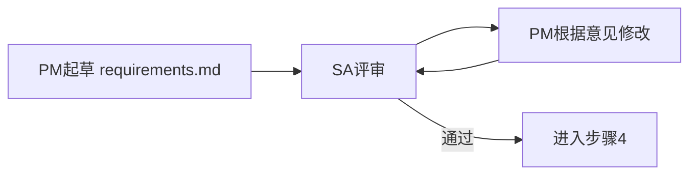
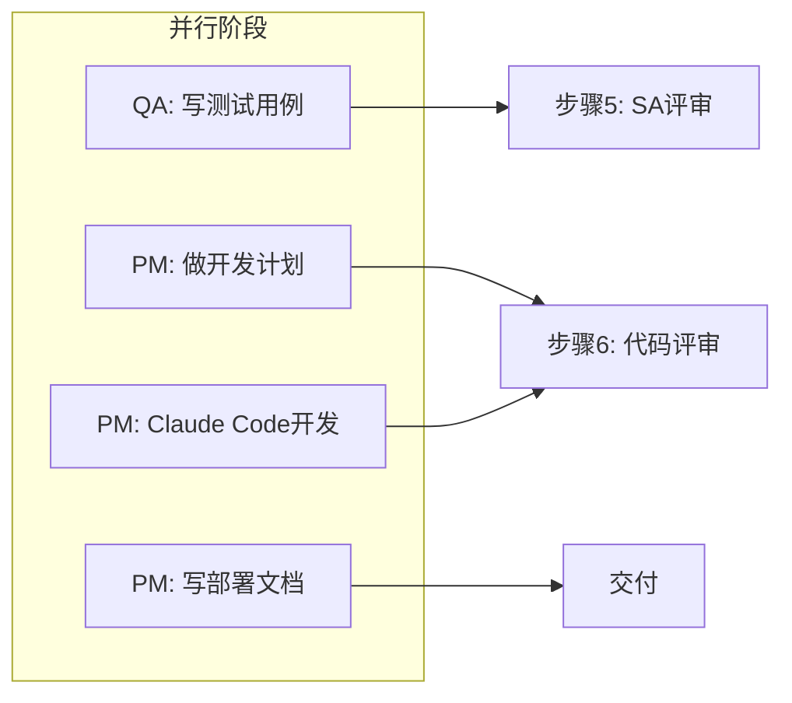
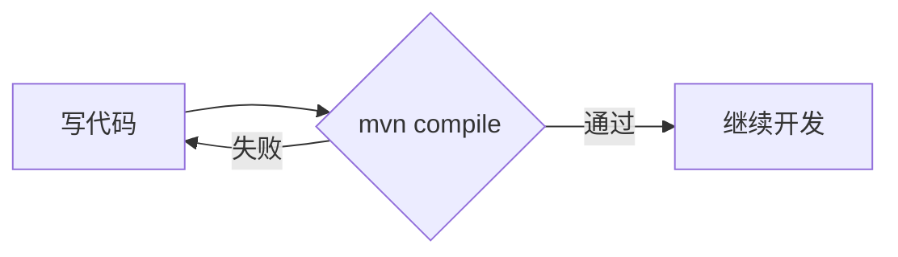
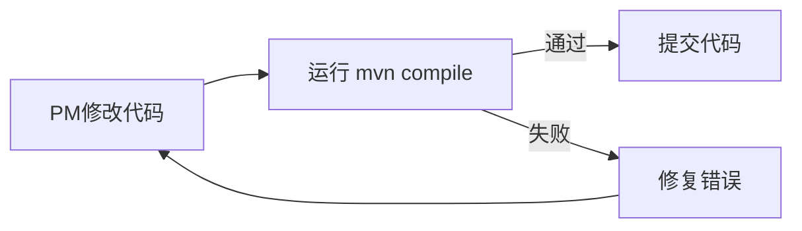

## 步骤3：PM根据评审优化文档

**PM -> 根据评审优化文档 -> requirements.md（更新）**

### 为什么是"更新"而不是"另起炉灶"

很多人在收到评审意见后，第一反应是"这份文档不行，要重写"。但这是一个认识误区。评审的目的不是推翻，而是精炼。如果你从头开始写一份新文档，会丢失很多在评审过程中已经被验证过的好的部分——那些评审员已经认可的内容是值得保留的。

正确的做法是：把评审当作一次深度校对。你保留文档中正确的部分，修改有问题的部分，补充遗漏的部分。这样做还有另一个重要好处：**保持文档的版本脉络清晰**。当你需要回顾"这个需求是怎么来的"时，修订记录会告诉你完整的思考过程。

### 更新时应该记录什么

每次修改 requirements.md 时，建议在文档末尾添加一个简单的变更记录：

```markdown
## 变更记录

### 2024-XX 更新（根据SA评审）
- 变更：[描述你做了什么修改]
- 原因：[为什么要这样改]
- 评审意见来源：[哪条评审意见触发了这个变更]
```

这种记录有几个价值：

1. **追溯性**：当你三个月后回头看文档，能理解每个决策的背景
2. **责任感**：记录"为什么这样改"比记录"改了什么"更重要
3. **团队对齐**：如果其他人在看这份文档，变更记录能帮助他们理解上下文

### 这是一个迭代过程

评审不是一次性事件。现实中，一个需求文档往往需要经历多轮迭代：



每一轮评审可能只是小幅修改，也可能发现根本性问题需要大幅调整。关键是：不要急于求成，追求"这一轮就让它通过"——质量比速度更重要。如果第一轮评审发现了两三个问题，那就认真改完再进入下一轮，而不是试图在第一轮就把所有细节都敲定。

---

## 步骤4：并行阶段（互不阻塞）

这是工作流中最关键的阶段。当 requirements.md 已经稳定之后，多个工作可以并行展开，彼此不阻塞。



并行阶段的核心思想是：**不同的人/角色在同一时期做不同的事**。QA 不需要等代码写完才写测试用例，因为测试用例是基于需求的；PM 不需要等测试用例完成才开始规划开发。这种并行能力是提高效率的关键。

下面分别说明四个并行任务。

### 4a. QA -> 测试用例 -> testcases.md

#### 测试用例是什么

测试用例是为每个功能点设计的具体测试场景。打个比方：如果 requirements.md 是"菜单"，那么 testcases.md 就是"点菜清单"——它告诉你具体要点哪些菜，每道菜要几分熟、要不要辣。

一个测试用例应该包含：

| 字段 | 说明 | 示例 |
|------|------|------|
| 用例ID | 唯一标识 | TC-001 |
| 功能点 | 对应哪个需求 | 登录功能 |
| 输入 | 测试输入 | 用户名: admin, 密码: 123456 |
| 预期输出 | 期望的结果 | 登录成功，跳转到首页 |
| 测试目的 | 为什么测这个 | 验证正常登录流程 |

#### 好的测试用例标准

**可重复执行**：这是核心要求。一个测试用例今天执行和明天执行，应该得到一致的结果。如果你的测试依赖"网络状况良好"或"服务器刚好不繁忙"，那就不是一个好的测试用例。

**覆盖边界条件**：除了测"正常情况"，还要测"边界情况"。例如：
- 空输入（用户名密码为空）
- 特殊字符（用户名包含 `<script>`）
- 超长输入（用户名长度为1000字符）
- 错误密码连续多次

#### 个人开发者如何写测试用例

你不必用 JUnit、Pytest 这样的测试框架。Markdown 同样可以写出高质量的测试用例。关键是你要思考清楚每个功能点的测试场景。

一个简单但有效的测试用例模板：

```markdown
## TC-001: 用户登录-正常流程

**功能点**: 登录功能  
**优先级**: P0（核心功能）

| 步骤 | 操作 | 输入 | 预期输出 |
|------|------|------|----------|
| 1 | 打开登录页 | - | 显示用户名、密码输入框 |
| 2 | 输入正确账号 | admin / pass123 | - |
| 3 | 点击登录 | - | 跳转至首页，显示用户信息 |

**边界条件覆盖**:
- 空密码 → 提示"密码不能为空"
- 错误密码 → 提示"用户名或密码错误"
- 不存在的用户 → 提示"用户名或密码错误"（不暴露哪个字段错误）
```

如果你习惯用代码写测试，也完全可以。对于 Java 项目可以用 JUnit，Python 项目可以用 pytest。但即使你用代码写测试，建议也维护一份 Markdown 版本的测试用例文档，因为它更易读、更容易和 QA/PM 共享。

---

### 4b. PM -> 开发计划 -> dev-plan.md

#### 开发计划是什么

开发计划是把需求转化为可执行的时间线。它回答的问题是：**我们什么时候能完成这个功能**。

一个开发计划通常包含：

1. **里程碑（Milestone）**：关键节点，如"原型完成"、"Alpha版本"、"Beta版本"
2. **任务分解（Task Breakdown）**：把一个大需求拆成小任务
3. **时间估计**：每个任务需要多长时间
4. **依赖关系**：哪些任务必须在前面的任务完成后才能开始

#### 为什么需要开发计划

没有开发计划的项目，就像没有地图的旅行。你知道自己要出发，但不知道什么时候能到，也不知道路上会经过哪些检查点。

开发计划的价值在于：

- **避免中途迷失**：每周检查进度时，你知道自己在哪
- **及早发现问题**：如果某个任务比预期慢两周，你能早点调整
- **便于和他人沟通**：当别人问"这个功能什么时候能好"，你有东西可以回答

#### 个人开发者如何做轻量级开发计划

对于个人开发者或小团队，不需要复杂的项目管理工具。一份 Markdown 文档就够了。

**建议用周为单位，不要精确到天**。这是因为：

1. 精确到天的计划往往不准——实际情况总会打乱计划
2. 以周为单位更灵活：如果这周没做完，顺延到下周就好
3. 心理压力更小：没有"今天必须完成"的紧迫感

一个简单的开发计划模板：

```markdown
## 开发计划：用户登录功能

### 里程碑
- Week 1: 完成数据库设计和基础架构
- Week 2: 实现前端登录页面和后端接口
- Week 3: 集成测试和bug修复
- Week 4: 部署和文档完善

### 任务分解

**Week 1**
- [ ] 设计用户表结构
- [ ] 搭建项目基础框架
- [ ] 配置开发环境

**Week 2**
- [ ] 实现后端登录API
- [ ] 实现前端登录页面
- [ ] 前后端联调

**Week 3**
- [ ] 编写测试用例
- [ ] 修复发现的bug
- [ ] 代码评审

**Week 4**
- [ ] 部署到测试环境
- [ ] 编写部署文档
- [ ] 用户验收
```

用 `[ ]` 来标记完成状态，每周结束时更新。这比任何项目管理软件都简单，但足够用。

---

### 4c. PM -> Claude Code 开发 -> code + mvn compile

#### 为什么 Claude Code 可以扮演 PM

Claude Code 本质上是一个能理解和执行开发任务的AI助手。当你把 requirements.md 提供给它时，它能够：

- 理解你要做什么
- 写出符合要求的代码
- 帮你解决开发中的问题

这意味着在并行阶段，你可以让 Claude Code 承担一部分开发工作，而你自己去做其他事情（如写部署文档、做开发计划）。

#### 如何给 Claude Code 清晰的开发指令

关键是把 requirements.md 作为输入告诉它。示例：

```
# 开发任务

根据 requirements.md 中定义的需求，实现用户登录功能。

## 技术栈
- Spring Boot 3.x
- Maven
- MySQL

## 要求
1. 后端API遵循RESTful规范
2. 密码需要加密存储
3. 编写单元测试

请开始实现，完成后运行 mvn compile 确保代码可以编译通过。
```

**越清晰的指令，越能得到好的结果**。不要只是说"帮我实现登录功能"，要把上下文、技术约束、质量要求都说明清楚。

#### mvn compile 是什么

`mvn compile` 是 Maven 项目的编译命令。Maven 是一个 Java 项目管理工具（类似的概念有 Gradle）。当你执行 `mvn compile` 时：

1. Maven 下载依赖
2. 编译 Java 源代码（从 `src/main/java` 到 `target/classes`）
3. 如果有编译错误，报告出来

#### compile 的重要性

能编译通过是代码正确性的**最基本门槛**。如果代码连编译都过不了，那它肯定有问题。



每次你用 Claude Code 写完代码，都应该运行 `mvn compile` 来验证。这个习惯能帮你早早发现问题，而不是等到运行时才发现。

#### 其他语言的等效命令

如果你用的不是 Java/Maven，对应关系如下：

| 语言 | 构建工具 | 编译/构建命令 |
|------|----------|---------------|
| Java | Maven | `mvn compile` |
| Java | Gradle | `./gradlew build` |
| JavaScript/TypeScript | npm | `npm run build` |
| JavaScript/TypeScript | yarn | `yarn build` |
| Python | pip/poetry | `python -m py_compile *.py` |
| Go | Go toolchain | `go build ./...` |
| Rust | Cargo | `cargo build` |

无论你用什么技术栈，核心原则是相同的：**写完代码后，先验证它能正常构建，再继续**。

---

### 4d. PM -> 部署文档 -> deploy.md

#### 部署文档的目的

部署文档的目标是：**让任何人都能复现你的运行环境**。这包括你自己（三个月后的你）和别人（合作者、评审者、未来的维护者）。

#### 部署文档应该包含什么

1. **依赖环境版本**
   - 操作系统版本
   - 语言运行时版本（如 Python 3.11.5）
   - 数据库版本（如 MySQL 8.0）
   - 其他关键依赖（如 Redis、Nginx）

2. **系统配置**
   - 环境变量说明
   - 配置文件位置
   - 端口占用情况

3. **部署步骤**
   - 一步步的操作指令
   - 启动命令
   - 健康检查方法

#### 博士研究的特殊性：如何记录实验环境以便复现

对于做研究的博士生，部署文档有一个额外的价值：**复现实验结果**。当你的论文需要描述实验环境时，这份文档就是最准确的来源。

建议研究者在部署文档中额外记录：

- 实验数据集的来源和版本
- 随机种子（确保可复现）
- 硬件配置（CPU、内存、GPU）
- 任何非标准配置

一个面向研究的部署文档片段示例：

```markdown
## 实验环境

### 硬件
- CPU: Intel i7-12700K
- 内存: 32GB DDR4
- GPU: NVIDIA RTX 3080 (10GB)

### 软件依赖
- Python: 3.10.8
- PyTorch: 2.1.0
- CUDA: 11.8
- scikit-learn: 1.3.0

### 数据集
- 训练集: Dataset-A v2.3 (来源: DOI:xxx)
- 测试集: Dataset-B v1.1 (来源: DOI:xxx)

### 随机种子
所有实验使用 seed=42 以确保可复现
```

---

## 步骤5：SA评审测试用例

**SA -> 评审测试用例 -> sa-test-review.md**  
**QA -> 优化测试用例 -> testcases.md（更新）**

### 为什么 SA 要评审测试用例

测试用例不是写完就算了——它需要被评审。SA（系统架构师）参与评审的原因是：

1. **确保测试覆盖了关键路径**：SA 最了解系统的核心功能在哪里，评审测试用例能发现"这个关键功能为什么没有测试"
2. **避免过度测试**：有些测试用例可能测了不重要的边界情况，浪费了测试资源
3. **发现测试遗漏**：SA 能从系统设计角度指出哪些场景还没有被测试覆盖

### 测试用例评审要点

SA 评审测试用例时，应该关注：

| 评审维度 | 具体检查项 |
|----------|------------|
| 覆盖性 | 核心功能是否都有测试用例？ |
| 正确性 | 预期输出是否和需求文档一致？ |
| 可执行性 | 测试步骤是否足够清晰，能否实际执行？ |
| 边界条件 | 是否覆盖了空值、极限值、异常值？ |
| 优先级 | P0（核心功能）是否都有高优先级的测试？ |

### 评审后的优化迭代

评审完成后，SA 会给出评审意见。QA 根据意见优化测试用例。这个过程和步骤3类似——是迭代优化，不是推倒重来。

常见评审意见的处理：

| 评审意见 | QA 的回应 |
|----------|-----------|
| "缺少对空值的测试" | 添加 TC-xxx，测试输入为空字符串的情况 |
| "预期输出与需求不一致" | 核对 requirements.md，修正预期输出 |
| "这个测试用例优先级应该是 P1" | 调整优先级标注 |

---

## 步骤6：SA代码评审 + PM回复

**SA -> 代码评审 -> sa-code-review.md**  
**PM -> 根据意见回复 + compile**

### 代码评审的重要性

代码评审（Code Review）是软件开发中最重要的质量关卡之一。它的价值体现在多个层面：

1. **发现潜在 bug**：评审者往往能发现作者忽略的问题，因为评审者是以"新读者"的视角在看代码
2. **发现风格问题**：代码风格不一会让团队成员阅读困难，评审能统一风格
3. **发现设计问题**：有时候代码逻辑没问题，但架构设计不合理，评审能提前发现
4. **知识传递**：评审过程也是团队成员互相学习的过程

### 个人开发者如何做代码自审

如果你是一个人开发，没有团队成员可以帮你评审，该怎么办？

**答案是：给自己写 code review 意见**。

具体做法：
1. 写完代码后，放一两天再回头看
2. 以"如果别人这样写，我会怎么评价"的视角来审视自己的代码
3. 把你自己发现的意见写下来，形成一份 "self-review.md"
4. 根据意见修改代码

这种方法听起来有点奇怪，但非常有效。关键在于：你要在"写代码"和"审代码"之间制造时间间隔，让自己从"作者"变成"读者"。

### 如何利用 AI 做代码评审

现代 AI 工具可以帮你做代码评审。你可以把代码贴给 AI，然后问：

- "这段代码有什么潜在问题？"
- "这段代码的性能如何？"
- "这段代码符合最佳实践吗？"

但要注意：AI 评审不能替代人类评审。AI 能发现语法问题和常见模式错误，但它不能理解你的业务逻辑，也不能判断"这段代码是否符合我们的设计意图"。

建议的 AI 评审使用方式：

```markdown
# AI 辅助代码评审清单

对每个文件，检查以下方面：

1. **语法正确性** - AI 能很好地发现这类问题
2. **潜在 NPE（空指针异常）** - AI 能识别
3. **资源泄漏（未关闭的文件/连接）** - AI 能识别模式
4. **安全漏洞** - AI 能识别常见安全问题
5. **设计合理性** - 需要人类判断
6. **业务逻辑正确性** - 需要人类判断
```

### 为什么 compile 很重要

在 PM 根据评审意见修改代码后，**必须重新运行 compile**。这是因为：

1. 修改可能引入新的编译错误
2. 修改可能破坏已有的功能
3. compile 是最基本的质量门槛



这个习惯能帮你避免"代码看起来没问题，但实际跑不起来"的情况。

---

## 总结

步骤 3-6 构成了工作流中的核心执行阶段：

- **步骤3**：根据评审意见优化文档，保持迭代
- **步骤4**：并行执行多个任务（测试用例、开发计划、代码开发、部署文档），最大化效率
- **步骤5**：SA 评审测试用例，确保测试覆盖了关键路径
- **步骤6**：SA 代码评审 + PM 回复，确保代码质量

这四个步骤不是线性的一次性流程，而是**循环迭代**的过程。在实际项目中，你可能需要在这些步骤之间反复，直到达到满意的质量标准。

对于博士研究者来说，这套流程的价值不仅在于提高开发效率，更在于：**它能帮你建立可复现的研究习惯**。当你的代码、环境、测试用例都有完整文档记录时，你的研究就会变得更容易复现、更容易验证，也更容易被他人理解。